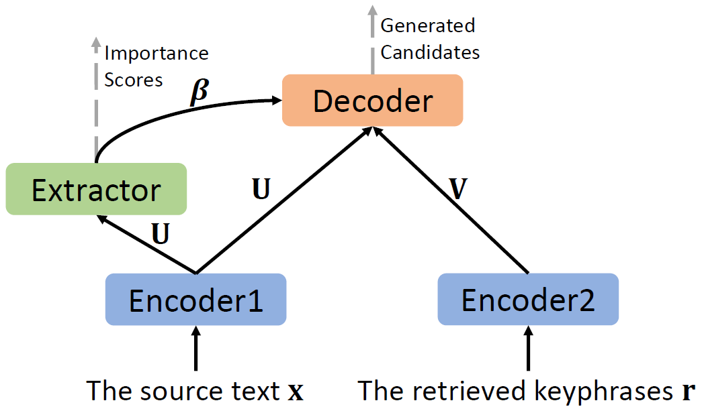

# KG-KE-KR-M
The processed datasets and source code for the NAACL19 paper "[An Integrated Approach for Keyphrase Generation via Exploring the Power of Retrieval and Extraction](https://arxiv.org/pdf/1904.03454.pdf)". The code is mainly based on [OpenNMT-py](https://github.com/OpenNMT/OpenNMT-py). Some codes are adapted from [seq2seq-keyphrase](https://github.com/memray/seq2seq-keyphrase). 

<p align="center"></p>

# Table of contents
   * [Dependencies](#dependencies)
   * [Get the filtered raw KP20k training dataset](#get-the-filtered-raw-kp20k-training-dataset)
   * [Data preprocess](#data-preprocess)
   * [Run our model](#run-our-model)
      - [KG-KE-KR training](#kg-ke-kr-training)
      - [KG-KE-KR inference](#kg-ke-kr-inference)
      - [Merging](#merging)
   * [Our Final Predictions](#our-final-predictions)
   * [Citation](#citation)
# Dependencies
- python 3.6.6
- pytorch 0.4.1 (CUDA9.0)
- torchtext 0.3.1

The full dependencies are listed in `requirements.txt`.

# Get the filtered raw KP20k training dataset
You can download the filtered raw **KP20k** training dataset [here](https://www.dropbox.com/s/kozr13nmw6cvb2q/kp20k_training_filtered.zip?dl=1). The statistics of the file are shown in the following table. Each empty (filtered) sample is stored as {"title": "", "keyword": "", "abstract": ""}.

Part | Number
--- | ---
Total | 530,802
Valid | 509,818
Empty | 20,984

The original training dataset from [Rui Meng](https://github.com/memray/seq2seq-keyphrase) contains `530,809` data samples. We do the following filtering procedures:

1. We filter out the data samples with empty title or empty abstract. `7` samples are filtered and `530,802` samples are remained.
2. From the `530,802` samples, we filter out `20,984` samples and remain `509,818` samples:
    - 2.1 The samples without valid keyphrases that contain 1-6 tokens. `168` samples are filtered.
    - 2.2 The duplicated samples with the **KP20k** traning dataset itself, the **KP20k** validation dataset, the **KP20k** testing dataset, the **Inspec** testing dataset, the **Krapivin** testing dataset, the **NUS** testing dataset, and the **SemEval** testing dataset. `20,816` duplicated samples are filtered. We regard two samples (papers) are duplicated when either condition a or condiation b is satisfied:
       - a. The Jaccard similarity between the corresponding non-stop-word sets of these two papers is larger or equal than 0.7.
       - b. The title of two papers are the same.

Finally, we obtain `509,818` valid data samples.
# Data preprocess
1. We lowercase, tokenize (use [stanfordcorenlp](https://github.com/Lynten/stanford-corenlp)), and replace the digit with "\<digit\>" token for all the text. You can download the processed data [here](https://www.dropbox.com/s/lgeza7owhn9dwtu/Processed_data_for_onmt.zip?dl=1).
   - The `*_context_filtered.txt` files and `*_context.txt` files store the context of each paper (i.e. the title + ". \<eos\>" + the abstract).
   - The `Training/word_kp20k_training_keyword_filtered.txt` and `Validation/word_kp20k_validation_keyword_filtered.txt` store the keyphrases of the training and validation datasets respectively. Each line is a keyphrase.
   - The `*_key_indicators_filtered.txt` files store the keyword indicators for each context token. `I` (`O`) means the corresponding context token is (not) a keyword. A context token is regarded as a keyword if (1) it is a non-stop-word and (2) it is one token of one of the gold keyphrases of this paper. 
   - The `*_context_nstpws_sims_retrieved_keyphrases_filtered.txt` files store the concatenated retrieved keyphrases of the top 3 similar papers. The retrieved keyphrases are split by a `<eos>` token. We utilize **Jaccard similarity** score between the non-stop-word sets of the two papers as the similarity score. For all the training, validation, and testing datasets, we use the filtered **KP20k** training dataset as the retrieval corpus.
   - The `Testing\*_context_nstpws_sims_retrieved_scores_filtered.txt` files store the **retrieval score** of each retrieved keyphrase, which is the corresponding Jaccard similarity score between the retrieved paper and the original paper.
   - The `Testing\*_testing_keyword.txt` files store the keyphrases of each testing paper. Each line contains all the keyphrases of a testing paper, which are split by a `;` token.

2. After downloading the processed text data, build a `KG-KE-KR/data/text_data/` folder and unzip the downloaded `*.zip` file into this folder. Then,  navigate to `KG-KE-KR/sh/preprocess/` folder and run the `preprocess_full.sh` file to prepare the onmt-preprocessed data (Note: You **MUST** replace `/research/king3/wchen/Anaconda3/envs/py3.6_th0.4.1_cuda9.0/bin/python` with your own python interpreter in all the `.sh` files to run them smoothly.): 
```
      cd KG-KE-KR/sh/preprocess/
      sh preprocess_full.sh
```
After running the onmt preprocessing, the following onmt-preprocessed data will be generated in `KG-KE-KR/data/onmt_processed_data/full_dataset/` folder:
- `full_dataset.train.*.pt`: serialized PyTorch files containing training data. `*` represents a number starting from 1.
- `full_dataset.valid.*.pt`: serialized PyTorch files containing validation data. `*` represents a number starting from 1.
- `full_dataset.vocab.pt`: serialized PyTorch file containing vocabulary data.

Note: If you use a slurm-managed server, use `sbatch preprocess_full.sh`. The `preprocess_full.sh` is to run `KG-KE-KR/preprocess.py`.  Part of the options are the following (check `KG-KE-KR/onmt/opts.py` for more details):
```
-train_src []: the file containing training source contexts, e.g., specified_TextData_path/word_kp20k_training_context_filtered.txt
-train_tgt []: the file containing training target keyphrases, e.g., specified_TextData_path/word_kp20k_training_keyword_filtered.txt
-train_key_indicators []: the file containing keyword indicators for each training source context, e.g., specified_path/word_kp20k_training_key_indicators_filtered.txt
-train_retrieved_keys []: the file containing retrieved keyphrases for each training source context, e.g., specified_TextData_path/word_kp20k_training_context_nstpws_sims_retrieved_keyphrases_filtered.txt
-valid_src []: the file containing validation source contexts, e.g., specified_TextData_path/word_kp20k_validation_context_filtered.txt
-valid_tgt []: the file containing validation target keyphrases, e.g., specified_TextData_path/word_kp20k_validation_keyword_filtered.txt
-valid_key_indicators []: the file containing keyword indicators for each validation source context, e.g., specified_TextData_path/word_kp20k_validation_key_indicators_filtered.txt
-valid_retrieved_keys []: the file containing retrieved keyphrases for each validation source context, e.g., specified_TextData_path/word_kp20k_validation_context_nstpws_sims_retrieved_keyphrases_filtered.txt
-save_data []: the path prefix to save the onmt-processed data, e.g., data/onmt_processed_data/full_dataset/full_dataset
-max_shard_size []: For text corpus of large volume, it will be divided into shards of this size to preprocess. If 0, the data will be handled as a whole. The unit is in bytes, e.g., 65536000.
-src_vocab_size []: size of the source vocabulary, e.g., 50000
-src_seq_length []: Maximum source sequence length, e.g., 400. The data examples with larger lengths than src_seq_length will be filtered. 
-tgt_seq_length []: Maximum target keyphrase sequence length, e.g. 6. The data examples with larger tgt lengths will be filtered
-dynamic_dict: a flag to build a dynamic dictionary for each data example. It MUST be set if you want to use copy mechanism in your model.
-share_vocab: a flag to share the vocabulary between source context and target keyphrase
```
# Run our model
## KG-KE-KR training
The framework of our end-to-end KG-KE-KR model is as the following:

<p align="center"></p>

You can run the following command lines to train a KG-KE-KR model:
```
cd KG-KE-KR/sh/train/
sh train_full.sh
```
The model checkpoints are saved in `KG-KE-KR/saved_models/end2end/seed3435_full_kg_ke_kr/` folder.

Note: If you use a slurm-managed server, use `sbatch train_full.sh`. The `train_full.sh` is to run `KG-KE-KR/train.py`. Part of the options are the following (check `KG-KE-KR/onmt/opts.py` for more details):
```
-save_model []: path prefix for saving model checkpoints
-data []: path prefix for the onmt-processed data
-vocab []: path prefix for the onmt-processed vocabulary
-share_embeddings: the flag to share embeddings between the encoder and the decoder
-key_model [key_selector|key_generator|key_end2end]: the chosen model to train. 'key_selector': Encoder1 + Extractor; 'key_generator': Encoder1 + Encoder2 (if -use_retrieved_keys) + Decoder; 'key_end2end': Encoder1 + Encoder2 (if -use_retrieved_keys) + Extractor + Decoder
-use_retrieved_keys: a flag to use the retrieved keyphrases
-only_rescale_copy: a flag to only rescale copy probabilities using the predicted importance scores from the selector (extractor)
-e2e_type [separate_enc_sel|share_enc_sel]: 'separate_enc_sel': use different encoding layer between the Encoder1 and the selector; 'share_enc_sel': share the encoding layer between the Encoder1 and the selector.
-sel_train_ratio []: the probability of training the selector using current batch
-sel_classifier [simple_fc|complex_Nallapati]: the chosen classifier for the selector.
-word_vec_size []: word embedding size, e.g., 100
-encoder_type [rnn|brnn]: 'rnn': unidirectional RNN layers; 'brnn': bidirectional RNN layers 
-enc_layers []: encoder layers, e.g., 1
-dec_layers []: decoder layers, e.g., 1
-rnn_size []: For an unidirectional RNN layer, it is the hidden size of the RNN cell. For a bidirectional RNN layer, rnn_size/2 is the hidden size of an RNN cell
-rnn_type [LSTM|GRU|SRU]: RNN cell type, e.g. GRU
-seed []: random seed, e.g. 3435
-pos_weight []: the positive weight for the weighted BCE loss when training the selector, e.g., 9.0
-sel_lambda []: the weight for the extraction loss, e.g. 1.0
-sel_normalize_by_length : a flag to normalize the extration loss with the source text length
-gen_lambda []: the weight for the generation loss, e.g. 1.0
-incons_lambda []: the werith for the inconsistency loss, e.g. 0.0 (means we do not consider the incosistency loss)
-optim [sgd|adagrad|adadelta|adam|sparseadam]: the chosen optimizer, e.g. adam
-max_grad_norm []: If the norm of the gradient vector exceeds this, renormalize it to have the norm equal to max_grad_norm
```
## KG-KE-KR inference
After the training is finished, open `KG-KE-KR/sh/translate/translate_full.sh` and change the value of `saved_model` to the name of the chosen model's `.pt` file. Then run the following command lines:
```
cd KG-KE-KR/sh/translate/
sh translate_full.sh
```
Note: If you use a slurm-managed server, use `sbatch translate_full.sh`. The `translate_full.sh` is to run `KG-KE-KR/translate.py`, Part of the options are the following (check `KG-KE-KR/onmt/opts.py` for more details):
```
-model []: a '.pt' file storing the finally chosen model
-output []: an output file to store generated keyphrase candidates, e.g., specified_log_path/seed3435_full_kg_ke_kr_kp20k.out
-scores_output []: an output file to store generation scores (beam search scores) of generated candidates, e.g., specified_log_path/seed3435_full_kg_ke_kr_kp20k_gen_scores.out
-sel_probs_output []: an output file to store predicted src token importance scores from the selector (extractor), e.g.,  specified_log_path/seed3435_full_kg_ke_kr_kp20k_sel_probs.out
-src []: a file storing testing source contexts, e.g., specified_TextData_path/word_kp20k_testing_context.txt
-retrieved_keys []: a file storing retrieved keyphrases of testing source contexts, e.g., specified_TextData_path/word_kp20k_testing_context_nstpws_sims_retrieved_keyphrases_filtered.txt
-key_indicators []: a file storing keyword indicators of testing source contexts, e.g., specified_TextData_path/word_kp20k_testing_key_indicators.txt
-beam_size []: beam size, e.g., 200
-n_best []: output the top n_best predictions
-max_length []: maximum prediction length, e.g., 6
-batch_size []: batch size
-kpg_tgt []: a file storing the gold keyphrases, e.g., specified_TextData_path/word_kp20k_testing_keyword.txt. This is used to evaluate the predictions stored in '-output' file.
-kpg_context []: a file storing testing source contexts, e.g., specified_TextData_path/word_kp20k_testing_context.txt. This is also used to evaluate the predictions stored in '-output' file.
-single_word_maxnum []: The maximum number of single-word predictions. Used when evaluating keyphrase predictions. 1 is used for Inspec, Krapivin, NUS, and SemEval datasets. -1 is used for KP20k dataset, which means we do not restrict the maximum number of single-word predictions 
```
We choose the final model using the following rules:
   - The trained model with the minimum generation ppl is chosen.
   - If there are multiple models with minimum generation ppl, choose the one with highest generation accuracy.
   - If there are multiple models with minimum generation ppl and highest generation accuracy, choose the one with the smallest training step.

The evaluation process is added into `KG-KE-KR/translate.py`. Thus, there are two stages when we run `KG-KE-KR/translate.py`:
   - **Inference stage**: the trained KG-KE-KR model is loaded to produce generated keyphrase candidates for the testing datasets. The generated candidates are stored in the `-output` file. The corresponding generation scores are stored in the `-scores_output` file. The predicted importance scores of source context tokens are stored in the `-sel_probs_output` file.
   - **Evaluation stage**: the MAP, Micro-averaged F1 scores, and Macro-averaged F1 scores are computed by comparing the predictions (i.e. `-output`) and ground-truth keyphrases (i.e. `-kpg_tgt`). The `-kpg_context` is used to split present and absent keyphrases.
## Merging
1. Download our trained reranker (scorer) [here](https://www.dropbox.com/s/8j17mrll5f77qaz/seed3435_reranker.zip?dl=1). Build `Merge/saved_models` folder and unzip the trained reranker in this folder.
2. Merge and rerank three kinds of keyphrase candidates:
```
   cd Merge/sh/merge_rerank/
   sh merge_rerank_full.sh
```
Note: If you use a slurm-managed server, use `sbatch merge_rerank_full.sh`. The `merge_rerank_full.sh` is to run `Merge/merge_rerank.py`, Part of the options are the following (check `Merge/onmt/opts.py` for more details):
```
-model []: the trained reranker (scorer) model, e.g., saved_models/seed3435_reranker.pt
-src []: a file storing testing source contexts, e.g., specified_TextData_path/word_kp20k_testing_context.txt. Here, the source context is used to produce extracted keyphrase candidates.
-tgt []: a file storing generated candidates, e.g., specified_log_path/seed3435_full_kg_ke_kr_kp20k.out
-gen_scores []: a file storing the generation scores of generated candidates, e.g., specified_log_path/seed3435_full_kg_ke_kr_kp20k_gen_scores.out
-retrieved_keys []: a file storing retrieved keyphrase candidates of testing source contexts, e.g., specified_TextData_path/word_kp20k_testing_context_nstpws_sims_retrieved_keyphrases_filtered.txt
-retrieved_scores []: a file storing the retrieval scores of retrieved keyphrase candidates, e.g., specified_TextData_path/word_kp20k_testing_context_nstpws_sims_retrieved_scores_filtered.txt
-sel_probs []: a file storing predicted src token importance scores from the selector (extractor), e.g.,  specified_log_path/seed3435_full_kg_ke_kr_kp20k_sel_probs.out
-merge_ex_keys: a flag to merge extracted candidates
-merge_rk_keys: a flag to merge retrieved candidates
-merge_with_stemmer: a flag to stem the tokens when merging
-reranked_scores_output []: an output file to store the final scores of final keyphrase predictions, e.g., specified_log_path/seed3435_full_kg_ke_kr_kp20k_merge_all_merged_reranked_scores.out
-output []: an output file to store the merged and reranked final keyphrase predictions, e.g., specified_log_path/seed3435_full_kg_ke_kr_kp20k_merge_all_merged_reranked.out
-sel_keys_output []: an output file to store the extracted keyphrase candidates, e.g., specified_log_path/seed3435_full_kg_ke_kr_kp20k_sel_keys.out
-kpg_context []: a file storing testing source contexts, e.g., specified_TextData_path/word_kp20k_testing_context.txt. This is also used to evaluate the predictions stored in '-output' file.
-kpg_tgt []: a file storing the gold keyphrases, e.g., specified_TextData_path/word_kp20k_testing_keyword.txt. This is used to evaluate the predictions stored in '-output' file.
-match_method [word_match|str_match]: matching method when spliting present and absent keyphrases. 'word_match': word-level matching; 'str_match': string-level matching.
-filter_dot_comma_unk [True]: Always True. If true, filter the keyphrases with dot, comma, or unk token before evaluation. Note that the filter_dot_comma_unk is always true even if you set '-filter_dot_comma_unk=False'. 
```
There are also two stages when we run `Merge/merge_rerank.py`:
   - **Merging stage**: At first, the extracted keyphrase candidates are produced based on the predicted importance score of each source text token. Then, the extracted, retrieved, and generated candidates are merged and reranked according to our merging method to produce final keyphrase predictions.
   
   <p align="center"></p>
   
   - **Evaluation stage**: the MAP, Micro-averaged F1 scores, and Macro-averaged F1 scores are computed by comparing the final merged and reranked predictions (i.e. `-output`) and ground-truth keyphrases (i.e. `-kpg_tgt`). The `-kpg_context` is used to split present and absent keyphrases.
# Our Final Predictions
You can download our raw final predictions of our KG-KE-KR-M method for the five testing datasets [here](https://www.dropbox.com/s/rxrxnqz768047el/KG-KE-KR-M%20Final%20Predictions.zip?dl=1). The prediction postprecessing is integrated in `evaluation_utils.py` including removing duplicated predictions, restricting the maximum number of single-word predictions (if set), and filtering predictions which contain dot, comma, or unk token.
# Citation
You can cite our paper by:
```
@inproceedings{chen-etal-2019-integrated,
    title = "An Integrated Approach for Keyphrase Generation via Exploring the Power of Retrieval and Extraction",
    author = "Chen, Wang  and
      Chan, Hou Pong  and
      Li, Piji  and
      Bing, Lidong  and
      King, Irwin",
    booktitle = "Proceedings of the 2019 Conference of the North {A}merican Chapter of the Association for Computational Linguistics: Human Language Technologies, Volume 1 (Long and Short Papers)",
    month = jun,
    year = "2019",
    address = "Minneapolis, Minnesota",
    publisher = "Association for Computational Linguistics",
    url = "https://www.aclweb.org/anthology/N19-1292",
    pages = "2846--2856",
}
```
